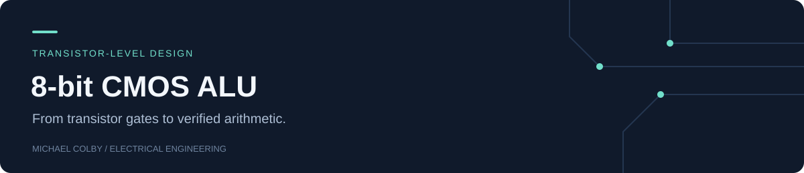
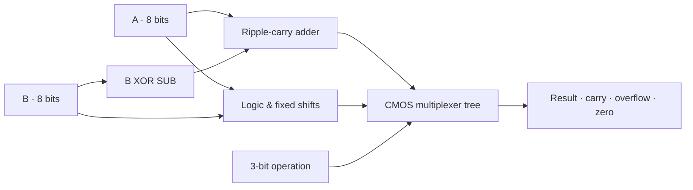

# CMOS 8-bit Arithmetic Logic Unit

[](https://github.com/michaelcolby-git/cmos-8bit-alu/actions/workflows/verify.yml)

A static CMOS ALU built from inverters, NAND/NOR gates, multiplexers, and full adders.
An RTL model establishes the functional contract; ngspice checks the transistor
hierarchy and measures a sensitized ripple-carry path.

| Digital verification | Transistor verification | Nominal measured path |
|---|---|---|
| 524,288 exhaustive vectors | 192 vectors across 3 voltage/temperature cases | 0.525 ns |

**[CMOS netlist](spice/alu8.cir) · [Gate library](spice/gates.cir) · [Measurements](docs/MEASUREMENTS.md) · [Results](results/VALIDATION.md)**

## Design



| Opcode | Result | Carry flag | Signed overflow |
|---|---|---|---|
| 0 | A + B | Unsigned carry-out | Addition overflow |
| 1 | A − B | 1 indicates no borrow | Subtraction overflow |
| 2 / 3 / 4 | AND / OR / XOR | 0 | 0 |
| 5 | NOT A | 0 | 0 |
| 6 / 7 | Logical left / right by one | Shifted-out bit | 0 |

Subtraction reuses the adder by complementing B and setting carry-in. The zero flag
reduces all result bits; arithmetic overflow is the XOR of the carries into and out
of the sign bit. [Design notes](docs/DESIGN_NOTES.md) explain these choices.

## Reproduce the results

Requirements: Python 3.10+, Icarus Verilog, and ngspice on PATH.

```sh
python -m unittest discover -s tests -p "test_*.py" -v
python scripts/verify.py --spice
```

The command generates the netlist, runs exhaustive RTL checks, verifies CMOS output
levels, and writes measured JSON, raw waveforms, logs, and an SVG to `build/`.
The optional executable overrides are `IVERILOG`, `VVP`, and `NGSPICE`.

## Measured carry-path response


At **1.8 V, 25 °C, 10 fF per output, and 100 ps input edges**, the included generic
Level-1 model produced **0.525110 ns** maximum delay over the two sampled carry-path
transitions and **64.470652 µW** total average supply power over 10–90 ns.

These are sampled-path measurements from this model and stimulus. They are not
foundry sign-off, an exhaustive analog worst case, or leakage-subtracted switching
power. The [measurement contract](docs/MEASUREMENTS.md) defines the crossings,
integration window, model, and functional acceptance thresholds.

Implementation origin and measurement scope are recorded in [PROVENANCE.md](PROVENANCE.md).
