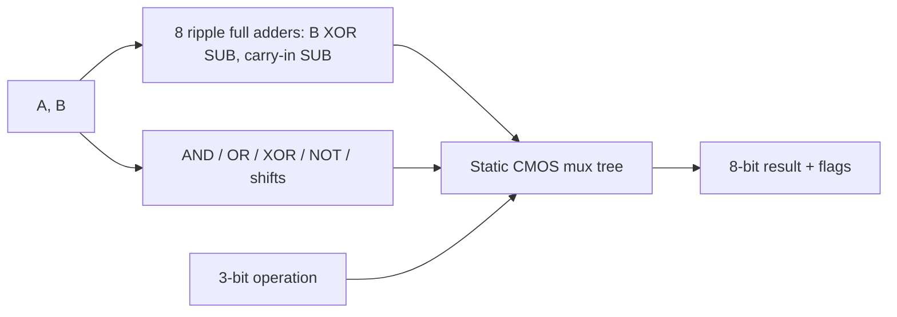

# 8-bit CMOS ALU

A reproducible reference design connecting static CMOS gates to an 8-bit ripple-carry
ALU, with an independently checked RTL model and transistor simulation scripts.
Read [PROVENANCE.md](PROVENANCE.md): this is a new reconstruction, not original Cadence evidence.

## Run

```sh
python scripts/verify.py --spice
```

Requires Python 3.10+, Icarus Verilog and ngspice on PATH. Without `--spice`, runs
524,288 digital vectors covering all inputs and all eight operations, checking result,
unsigned carry/no-borrow, signed overflow, and zero. Analog checks use directed vectors
and supply/temperature cases; digital exhaustiveness does not imply analog exhaustiveness.

## Design



| op | Operation | carry | overflow |
|---|---|---|---|
| 0 | A + B | Unsigned carry | Signed addition overflow |
| 1 | A - B | 1 means no borrow | Signed subtraction overflow |
| 2/3/4 | AND / OR / XOR | 0 | 0 |
| 5 | NOT A | 0 | 0 |
| 6/7 | Logical left / right by one | Bit shifted out | 0 |

- [RTL](rtl/alu8.v) and [exhaustive testbench](tests/tb_alu8.v)
- [CMOS gate library](spice/gates.cir) and [8-bit netlist](spice/alu8.cir)
- [Characterization](scripts/characterize.py) and [measurement definitions](docs/MEASUREMENTS.md)

Generic Level-1 MOS models, illustrative 0.18 um channel length, nominal 1.8 V,
and explicit output capacitance. These are not a calibrated process or timing sign-off.
The scripts produce actual current-run measurements in `build/`; no claim is made
that they reproduce 0.9 ns, 45 uW, or a 17% improvement from the resume.

## Measured validation

524,288 digital vectors and 192 transistor-level vectors passed. At 1.8 V / 25 C,
the sampled carry-path delay was **0.525 ns** and total average supply
power was **64.47 uW** under the included generic model.
These are current simulation results; see the [conditions and logs](results/VALIDATION.md).


