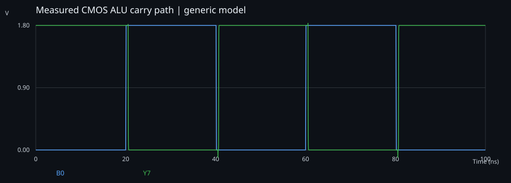

# Local validation

Executed with Python 3.12.14 on Windows, Icarus Verilog 10.1 (HDL), and ngspice 47 (analog), as applicable.

- Exhaustive RTL: **524,288 vectors passed**, including result, carry, overflow, and zero.
- Transistor functional checks: **192 vectors passed** across 1.8 V / 25 C, 1.62 V / 85 C, and 1.98 V / -20 C.
- Nominal sampled carry-path delay: **0.525110 ns**.
- Nominal total average supply power: **64.470652 uW**.
- Seven Python measurement/comparison tests passed.

These numbers apply to the included reference implementation and test conditions.
Local checks are not formal verification, timing closure, silicon measurements, or
a reproduction of original resume measurements. GitHub Actions must be checked
separately after publishing; no cloud run is asserted by this local report.
